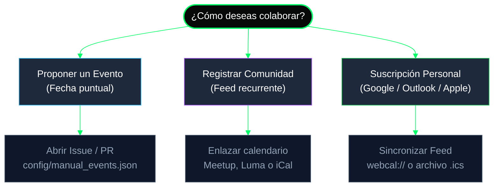
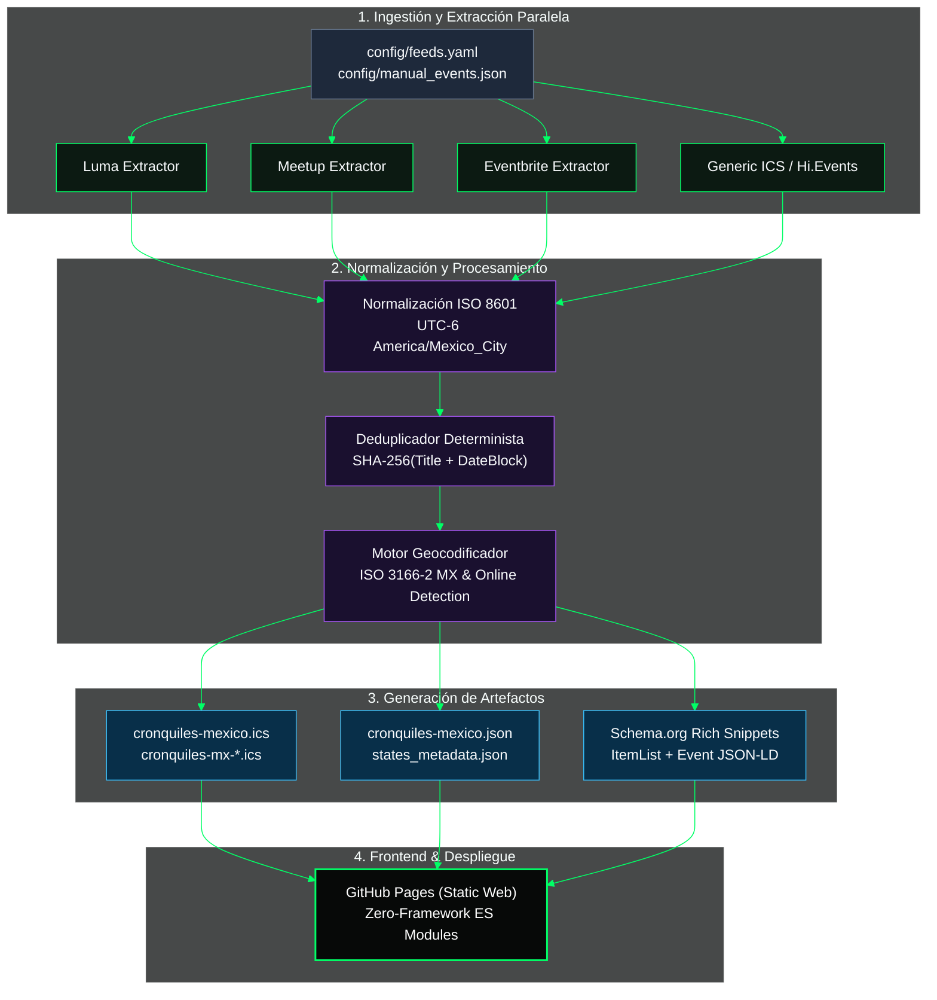

# CRON-QUILES

> **El calendario unificado del ecosistema tecnológico en México.**
> Agregador automatizado de código abierto que sincroniza, normaliza, geocodifica y deduplica convocatorias técnicas desde Meetup, Luma, Eventbrite y feeds iCal en un pipeline estático de alta disponibilidad.

[](https://opensource.org/licenses/MIT)
[](https://www.python.org/downloads/)
[](https://github.com/psf/black)
[](https://shellaquiles.github.io/cron-quiles/)

[](https://www.buymeacoffee.com/pixelead0)

> [!TIP]
> **Sitio Web Oficial & Calendario en Vivo:** [https://shellaquiles.github.io/cron-quiles/](https://shellaquiles.github.io/cron-quiles/)

---

## 1. ¿Cómo Participar?



### Proponer un Evento Individual
Si organizas un meetup, hackathon, taller o conferencia puntual (presencial o virtual):
* [x] **Vía Issue:** Abre un formulario con la plantilla **[Proponer un Evento](https://github.com/shellaquiles/cron-quiles/issues/new?template=proponer-evento.md)**.
* [ ] **Vía Pull Request:** Añade el objeto del evento en [`config/manual_events.json`](docs/MANUAL_EVENTS.md).

### Sumar tu Comunidad a la Red Abierta
Si lideras un grupo de usuarios, capítulo local o gremio tecnológico con agenda periódica:
* [x] **Registro Automático:** Abre un formulario en **[Registrar mi Comunidad](https://github.com/shellaquiles/cron-quiles/issues/new?template=registrar-comunidad.md)**.
* [x] **Integración Continua:** Enlazamos tu calendario público (Meetup, Luma, Eventbrite o iCal) para sincronizar tus fechas automáticamente cada 6 horas.
* [ ] Consulta el catálogo activo en [docs/COMMUNITIES.md](docs/COMMUNITIES.md).

### Suscripción a tu Calendario Personal
Mantén tu agenda al día en tu cliente de calendario preferido:
* **Google Calendar:** `+ Añadir calendario` $\rightarrow$ `Por URL` $\rightarrow$ Pega el feed `.ics`.
* **Apple Calendar (iOS / macOS):** `Archivo` $\rightarrow$ `Nueva suscripción de calendario` $\rightarrow$ Pega la URL.
* **Microsoft Outlook / Office 365:** `Agregar calendario` $\rightarrow$ `Suscribir desde web`.
* Enlaces directos en: [https://shellaquiles.github.io/cron-quiles/suscribir.html](https://shellaquiles.github.io/cron-quiles/suscribir.html)

---

## 2. Fuentes e Integraciones Soportadas

Cron-Quiles implementa agregadores modulares independientes en `src/cronquiles/aggregators/`:

| Plataforma / Fuente | Módulo Backend | Protocolo / Extracción | Normalización y Saneamiento |
| :--- | :--- | :--- | :--- |
| **Luma** (`lu.ma`) | [`luma.py`](src/cronquiles/aggregators/luma.py) | JSON-LD / API Microdata & feeds iCal | Limpieza de tags HTML en descripciones, resolución de URL canónica y normalización de ubicaciones físicas. |
| **Meetup** | [`meetup.py`](src/cronquiles/aggregators/meetup.py) | `__NEXT_DATA__` Runtime & Feeds ICS | Deserialización de objetos `Venue` (dirección, lat/lon), organizadores y conversión a UTC. |
| **Eventbrite** | [`eventbrite.py`](src/cronquiles/aggregators/eventbrite.py) | OpenGraph & Schema.org Scraping | Soporte para eventos únicos y perfiles completos de organizadores. |
| **GDG Community** | [`gdgcommunitydev.py`](src/cronquiles/aggregators/gdgcommunitydev.py) | Bevy Platform REST API | Extracción estructurada de Google Developer Groups (GDG) y Google Cloud Chapters. |
| **Hi.Events** | [`hievents.py`](src/cronquiles/aggregators/hievents.py) | Direct REST Endpoints | Integración con plataformas de boletaje open source autohospedadas (ej. Pythonistas GDL). |
| **Feeds Genéricos** | [`ics.py`](src/cronquiles/aggregators/ics.py) | RFC 5545 Deserializer | Conversión horaria estricta (`zoneinfo`), eventos recurrentes y compatibilidad `webcal://`. |
| **Eventos Manuales** | [`manual.py`](src/cronquiles/aggregators/manual.py) | Local JSON Ingestion | Inyección de convocatorias comunitarias sin infraestructura de feed público. |

---

## 3. Arquitectura del Pipeline ETL



---

## 4. Ingeniería y Algoritmos de Procesamiento

<details>
<summary><b>4.1 Algoritmo de Deduplicación Determinista Multi-Fuente</b></summary>

Cuando una misma conferencia o meetup es publicado en múltiples plataformas (por ejemplo Luma y Meetup):

1. **Firma Hash Canónica:** Se computa una clave hash SHA-256 normalizada e insensible a mayúsculas, signos de puntuación y variaciones menores de horario:
   $$\text{HashKey} = \text{SHA-256}\Big(\text{slug}(\text{title}) + \text{bucket}_{6\text{h}}(\text{dtstart})\Big)$$
2. **Fusión Multi-Plataforma:**
   - Se selecciona la descripción más extensa y enriquecida.
   - Se consolidan todos los enlaces de registro en un arreglo `sources` para proveer botones multi-destino en la UI.
</details>

<details>
<summary><b>4.2 Motor de Geocodificación e Inferencia Territorial</b></summary>

- Analiza el texto libre de `location` contra un diccionario jerárquico de códigos postales, municipios y zonas metropolitanas de México.
- Asigna códigos de estado **ISO 3166-2:MX** (`MX-CMX`, `MX-JAL`, `MX-NLE`, `MX-PUE`, `MX-YUC`, etc.).
- Clasifica automáticamente como `ONLINE` si la dirección contiene palabras clave de virtualidad (Zoom, YouTube, Google Meet, Discord, Twitch).
</details>

<details>
<summary><b>4.3 Frontend Reactivo Zero-Framework & SEO Programático</b></summary>

- **Zero Build / Zero Framework:** Construido íntegramente con Vanilla JavaScript (ES Modules) y CSS Custom Properties. Cero overhead de compilación o empaquetado.
- **Datos Estructurados Dinámicos:** Generación en tiempo de ejecución de esquemas Schema.org (`WebApplication`, `FAQPage`, `ItemList`, `Event`) para indexación en Google Rich Results.
- **Modo Matrix High-Contrast:** Paleta verde fósforo sobre negro azabache con cero fatiga visual.
- **Navegación por Teclado:** Control total con atajos (<kbd>→</kbd>, <kbd>←</kbd>, <kbd>U</kbd>, <kbd>T</kbd>, <kbd>D</kbd>, <kbd>?</kbd>).
</details>

---

## 5. Estructura del Repositorio

```
cron-quiles/
├── config/
│   ├── feeds.yaml                  # Catálogo de comunidades y feeds fuente
│   └── manual_events.json          # Registro de eventos manuales
├── src/cronquiles/
│   ├── aggregators/                # Extractores modulares por plataforma
│   │   ├── base.py                 # Clase abstracta BaseAggregator
│   │   ├── luma.py                 # Extractor Luma (JSON-LD / iCal)
│   │   ├── meetup.py               # Extractor Meetup (__NEXT_DATA__)
│   │   ├── eventbrite.py           # Extractor Eventbrite
│   │   ├── gdgcommunitydev.py      # Extractor GDG / Bevy
│   │   ├── hievents.py             # Extractor Hi.Events REST API
│   │   ├── ics.py                  # Extractor Genérico RFC 5545
│   │   └── manual.py               # Ingestión de eventos manuales
│   ├── ics_aggregator.py           # Pipeline de orquestación y normalización
│   ├── models.py                   # Modelos de datos y motor geocoder
│   └── main.py                     # Entrypoint CLI del pipeline
├── gh-pages/                       # Frontend estático desplegado en GitHub Pages
│   ├── css/                        # Arquitectura CSS (tokens, layout, componentes)
│   ├── js/                         # Vanilla ES Modules (Calendar, I18n, Storage, App)
│   ├── data/                       # Artefactos generados (.ics, .json)
│   ├── index.html                  # Portada y feed de eventos destacados
│   ├── eventos.html                # Calendario mensual y vista continua
│   ├── comunidades.html            # Catálogo de comunidades aliadas
│   ├── suscribir.html              # Guía de suscripción iCal / WebCal
│   ├── robots.txt                  # Directivas de rastreo
│   └── sitemap.xml                 # Sitemap XML oficial
├── tests/                          # Suite de pruebas unitarias (pytest)
├── Makefile                        # Tareas automatizadas de desarrollo
└── pyproject.toml                  # Dependencias y metadatos del proyecto
```

---

## 6. Desarrollo Local

### Requisitos Previos
* [x] **Python 3.10+**
* [x] **[uv](https://docs.astral.sh/uv/)** (recomendado para gestión ultrarrápida de dependencias)

### Instalación y Ejecución

```bash
# 1. Clonar el repositorio
git clone https://github.com/shellaquiles/cron-quiles.git
cd cron-quiles

# 2. Instalar dependencias en entorno virtual aislado
make install-dev

# 3. Ejecutar el pipeline de procesamiento local
make run-all

# 4. Iniciar el servidor local de desarrollo
make serve
# ➜ Servidor activo en http://localhost:8042
```

### Comandos de Utilidad (`Makefile`)

| Comando | Acción |
| :--- | :--- |
| `make run-all` | Ejecuta el pipeline completo de ingestión, geocodificación y exportación. |
| `make serve` | Inicia el servidor estático local en el puerto `8042`. |
| `make test` | Ejecuta la suite de pruebas automatizadas con `pytest`. |
| `make format` | Formatea el código con `black` y `isort`. |
| `make lint` | Ejecuta análisis estático con `flake8`. |
| `make clean` | Elimina archivos temporales, cachés de Python y artefactos de build. |

---

## 7. Documentación Técnica de Referencia

> [!IMPORTANT]
> Para detalles arquitectónicos específicos y guías internas de mantenimiento:
> - **Catálogo de Comunidades:** [`docs/COMMUNITIES.md`](docs/COMMUNITIES.md)
> - **Especificación de Eventos Manuales:** [`docs/MANUAL_EVENTS.md`](docs/MANUAL_EVENTS.md)
> - **Arquitectura del Pipeline:** [`.agents/instructions/08-pipeline-architecture.md`](.agents/instructions/08-pipeline-architecture.md)
> - **Estructura de Módulos:** [`.agents/instructions/09-project-structure.md`](.agents/instructions/09-project-structure.md)

---

## 8. Mantenedores y Contribuidores

Agradecemos a quienes impulsan y han colaborado con código, datos y mantenimiento en este agregador comunitario:

* **pixelead0** ([@pixelead0](https://github.com/pixelead0))
* **Ricardo Lira** ([@richlira](https://github.com/richlira))
* **Ivan Galaviz** ([@ivanovishado](https://github.com/ivanovishado))
* **Raul Estrada** ([@uurl](https://github.com/uurl))
* **Geronimo Orozco** ([@patux](https://github.com/patux))
* **Daniel Paredes** ([@DanielParedes](https://github.com/DanielParedes))
* **Mariano Rodríguez** ([@MarianoRD](https://github.com/MarianoRD))
* **Ben / dataforxyz** ([@dataforxyz](https://github.com/dataforxyz))
* **Ushieru** ([@ushieru](https://github.com/ushieru))
* **ForestKeeperIO** ([@ForestKeeperIO](https://github.com/ForestKeeperIO))

---

## 9. Licencia & Créditos

```
MIT License - Copyright (c) 2026 Shellaquiles Community
```

Proyecto de código abierto mantenido por **[shellaquiles.org](https://shellaquiles.org)** con el objetivo de fomentar la colaboración y el libre acceso a los espacios de aprendizaje técnico en México.
